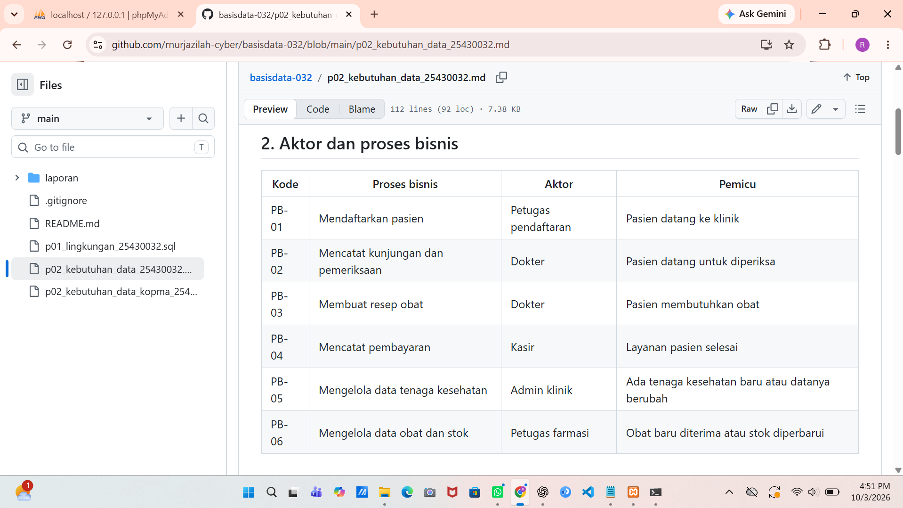
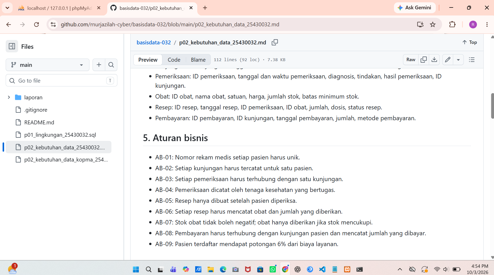
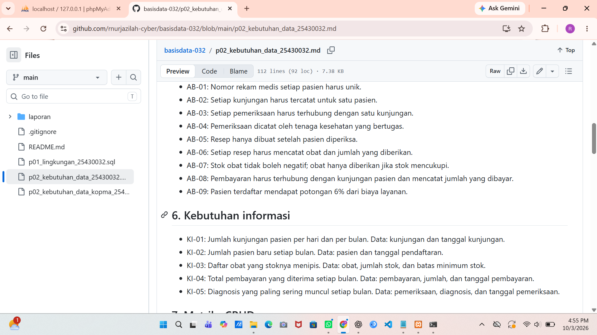
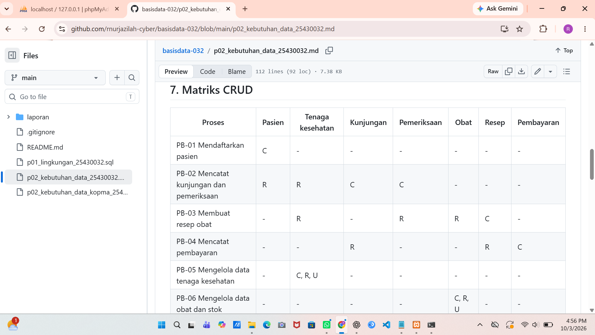
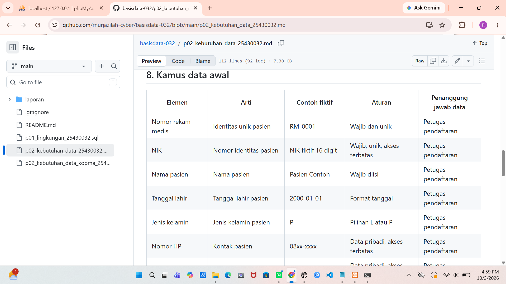
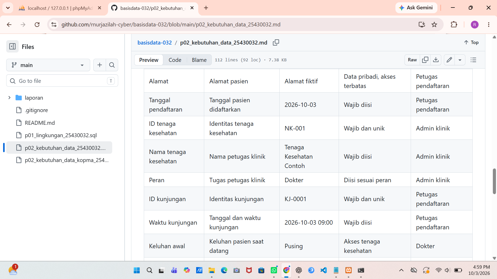
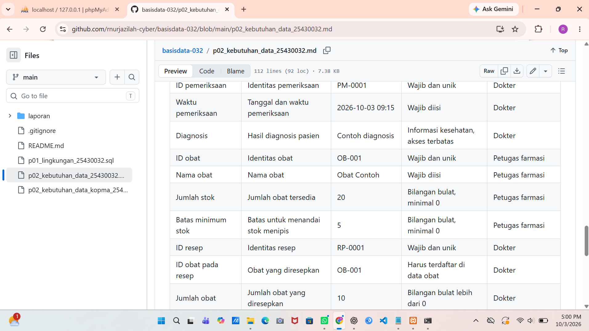
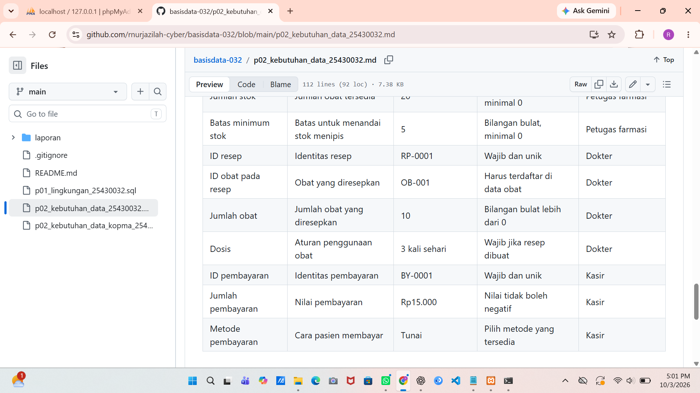

# LAPORAN PRAKTIKUM BASIS DATA

## MODUL 2 — ANALISIS KEBUTUHAN DATA

Nama: Riska Nur Jazilah  
NIM: 25430032  
Mata Kuliah: Basis Data  
Kelas: A  
Semester: 3  
Tanggal Praktikum: 3 Oktober 2026

## 1. Tujuan Praktikum

Praktikum ini bertujuan mengidentifikasi aktor dan proses bisnis, menentukan data yang perlu dikelola, menyusun aturan bisnis serta matriks CRUD, dan membuat kamus data awal untuk kebutuhan organisasi.

## 2. Dasar Teori

Analisis kebutuhan dilakukan sebelum merancang basis data agar data yang dibutuhkan organisasi dapat dikenali sejak awal. Kebutuhan mencakup data yang disimpan, informasi yang ingin dihasilkan, aturan bisnis yang harus dipatuhi, dan kebutuhan non-fungsional seperti privasi serta lama penyimpanan. Matriks CRUD menunjukkan proses yang membuat, membaca, mengubah, atau menghapus data. Kamus data menjelaskan arti setiap elemen data, aturan, dan pihak yang bertanggung jawab.

## 3. Langkah Praktikum

Saya membaca studi kasus Kopma, lalu mengidentifikasi aktor dan proses bisnisnya. Saya menelaah formulir anggota, nota penjualan, faktur pemasok, dan catatan stok untuk menemukan data yang perlu dicatat. Dari sana, saya menyusun entitas kandidat, aturan bisnis, kebutuhan informasi, matriks CRUD, dan kamus data awal. Untuk proyek Klinik Sehat RNJ, saya menyusun dokumen kebutuhan data dengan struktur yang sama dan menghitung parameter P berdasarkan NIM.

Bukti tabel pada dokumen proyek yang ditampilkan di GitHub:

## 4. Jawaban Titik Analisis

### Titik Analisis 1
Harga barang pada nota perlu disimpan sesuai harga saat transaksi. Jika harga barang berubah, nota lama tetap menunjukkan nilai yang benar dan jumlah pembayaran dapat diperiksa kembali.

### Titik Analisis 2
Subtotal dan total dapat dihitung dari jumlah barang, harga satuan, dan diskon, sehingga tidak menyimpan hasil hitungan dapat mengurangi data berulang. Namun, total pembayaran yang benar-benar dibayar dapat disimpan sebagai bukti transaksi dan untuk keperluan pemeriksaan.

### Titik Analisis 3
Kolom Pemasok tidak memiliki huruf C, artinya belum ada proses yang membuat data pemasok. Proses “Mengelola data pemasok” perlu ditambahkan agar pemasok baru bisa dicatat. Status aktif anggota juga perlu diperbarui melalui proses pengelolaan status keanggotaan.

## 5. Hasil Latihan dan Modifikasi

### Poin loyalitas

Data tambahan yang dicatat adalah saldo poin anggota, poin yang diperoleh, dan poin yang ditukar.

- AB-07: Setiap kelipatan Rp10.000 dari belanja anggota yang transaksinya selesai menghasilkan 1 poin.
- AB-08: Anggota dapat menukar 50 poin dengan potongan Rp5.000 jika saldo poinnya mencukupi.
- KI-05: Menampilkan saldo poin setiap anggota. Data yang diperlukan: anggota, penjualan, poin yang diperoleh, dan poin yang ditukar.

Pada PB-02, data Anggota dibaca dan diperbarui, sehingga huruf pada kolom Anggota di matriks CRUD menjadi `R, U`.

### Perbaikan pernyataan kebutuhan

- “Data anggota harus aman” menjadi: “Hanya ketua koperasi yang dapat melihat nomor HP anggota.”
- “Sistem harus cepat mencari barang” menjadi: “Pencarian barang berdasarkan kode atau nama menampilkan hasil dalam waktu maksimal 2 detik.”
- “Laporan stok harus akurat” menjadi: “Jumlah stok pada laporan harus sama dengan stok awal ditambah barang yang diterima, dikurangi barang yang terjual.”

## 6. Tugas Mandiri: Milestone Proyek 2

Tema proyek saya adalah klinik dengan nama organisasi fiktif Klinik Sehat RNJ. Dokumen kebutuhan data proyek memuat 6 proses bisnis, 7 entitas kandidat, 9 aturan bisnis, 5 kebutuhan informasi, matriks CRUD, dan kamus data dengan lebih dari 20 elemen. Dokumen juga mencantumkan formulir pendaftaran pasien sebagai dokumen sumber fiktif.

Perhitungan parameter: P = (32 mod 9) + 1 = 6. Maka batas maksimal item adalah 8, diskon 6%, dan perkiraan volume 70 transaksi per hari.

## 7. Pembahasan dan Kendala

Pemeriksaan matriks CRUD menunjukkan bahwa data pemasok belum dibuat oleh proses mana pun. Saya menambahkan proses PB-06 untuk mengelola data pemasok dan PB-07 agar status anggota dapat diperbarui oleh ketua koperasi. Tabel Markdown saya periksa kembali melalui tampilan GitHub.

## 8. Kesimpulan

Analisis kebutuhan membantu saya menentukan data yang perlu dikelola Klinik Sehat RNJ. Dokumen proyek sudah memuat proses bisnis, aturan, kebutuhan informasi, matriks CRUD, dan kamus data. Parameter proyek dihitung berdasarkan NIM dengan hasil P = 6.

## 9. Pernyataan Penggunaan AI

Saya menggunakan ChatGPT untuk membantu memahami instruksi Modul 2 dan merapikan draf. Isi dokumen saya periksa kembali.

## 10. Bukti Git

Repositori: https://github.com/rnurjazilah-cyber/basisdata-032  
Commit Modul 2: `8fab061` — `p02: lengkapi proses dan matriks Kopma`